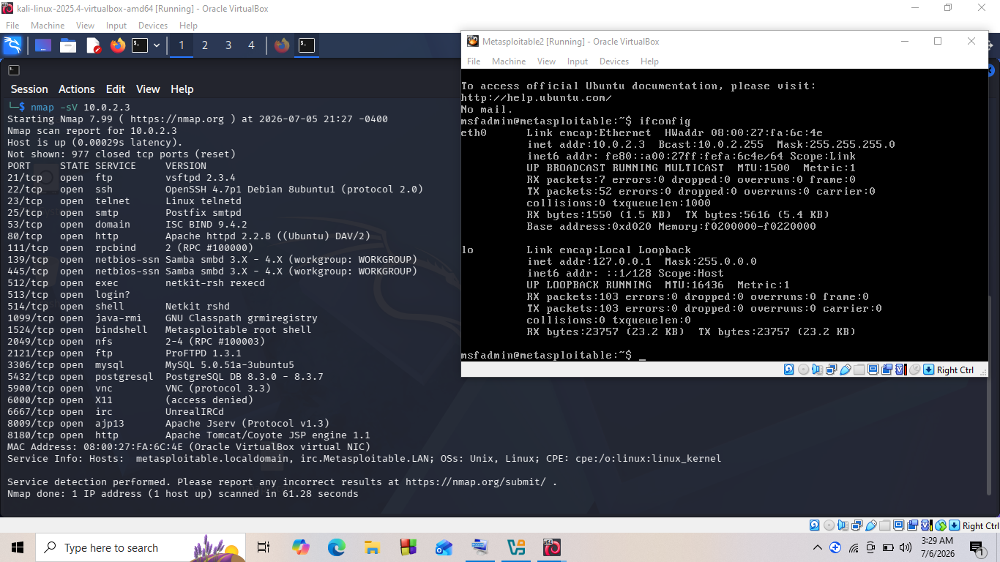
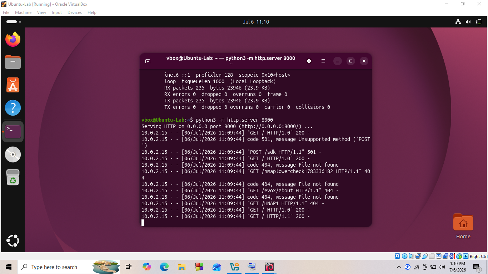
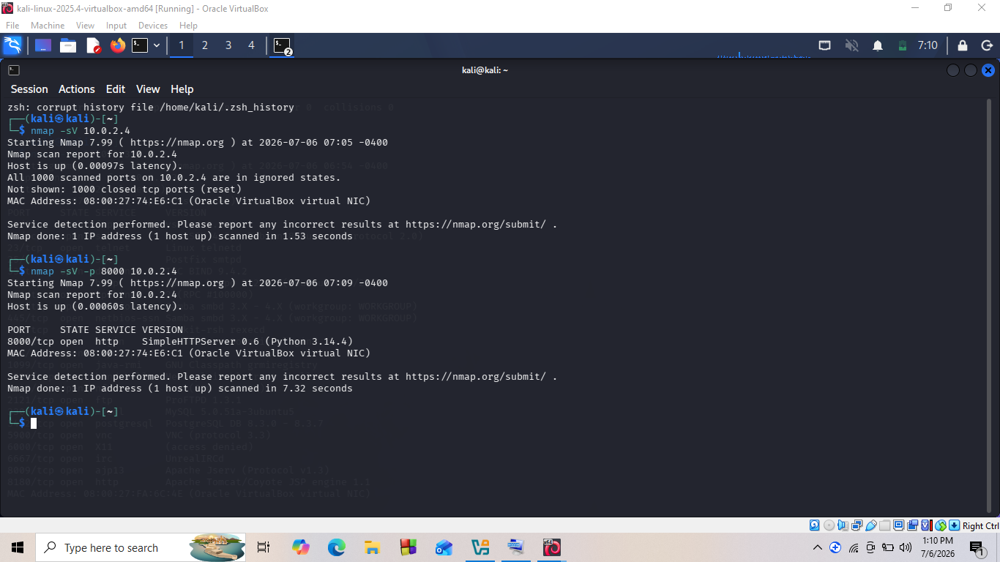
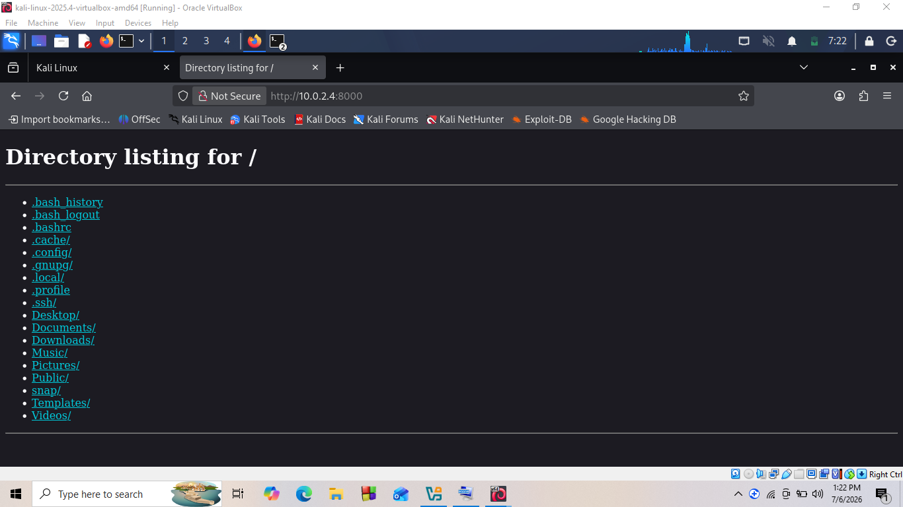

# Cybersecurity-labs

## Network Discovery and Nmap Scan

## Objective
To verify connectivity between the virtual machines and perform an Nmap scan against the Metasploitable 2 and Ubuntu virtual machines to identify open ports and running services.

## Lab Environment

Machine	Operating System	IP Address
Kali Linux	Kali Linux 2025.x	10.0.2.15
Ubuntu	Ubuntu 26.04 LTS	10.0.2.4
Metasploitable 2	Linux	10.0.2.3

## Tools Used

Nmap 7.99
VirtualBox
Kali Linux Terminal

## Commands Used
nmap -sV 10.0.2.3
python3 -m http.server 8000
nmap -sV -p 8000 10.0.2.4
nmap -A 10.0.2.3 -oN metasploitable_scan.txt

## Key Findings

## Screenshots

## Lessons Learned

Learned how to discover hosts on a network.
Learned how to perform service detection using Nmap.
Learned how to save scan results.

## Conclusion
This lab successfully demonstrated network 
discovery and service enumeration using Nmap
